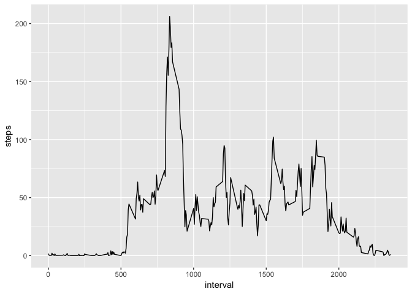

## Loading and preprocessing the data

Here we load the necesary packages (Tidyverse) and read the database in the activity object.


```r
library(tidyverse)

activity <- read_csv("activity.zip")
```


## What is mean total number of steps taken per day?

We construct a *stepsPerDay* data frame with the summarized sum of steps for every day and glimpse their content with *head()*.


```r
stepsPerDay <- activity %>% 
    group_by(date) %>% 
    summarise(steps = sum(steps))

head(stepsPerDay)
```

```
## # A tibble: 6 x 2
##   date       steps
##   <date>     <dbl>
## 1 2012-10-01    NA
## 2 2012-10-02   126
## 3 2012-10-03 11352
## 4 2012-10-04 12116
## 5 2012-10-05 13294
## 6 2012-10-06 15420
```

Here we make histogram total number of steps taken for each days. We also plot 2 vertical lines for the x value of the mean an median (they are roughly the same).


```r
ggplot(stepsPerDay, aes(x = steps)) + 
    geom_histogram(bins = 20, fill = "orange") +
    geom_vline(xintercept = mean(stepsPerDay$steps, 
                                 na.rm = TRUE), lty = 2, lwd = 2) +
    geom_vline(xintercept = median(stepsPerDay$steps, 
                                   na.rm = TRUE), lty = 2, lwd = 2)
```

<!-- -->

The mean steps taken per day were:


```r
 mean(stepsPerDay$steps, na.rm = TRUE)
```

```
## [1] 10766.19
```

The median steps taken per day were:


```r
median(stepsPerDay$steps, na.rm = TRUE)
```

```
## [1] 10765
```


## What is the average daily activity pattern?

We generate a *avgSteps* data frame with the average steps of the 5-min across all the days. Then we plot a time series plot with geom_line(). 


```r
avgSteps <- activity %>% 
    group_by(interval) %>% 
    summarise(steps = mean(steps, na.rm = TRUE))
ggplot(avgSteps, aes(x = interval,y = steps)) + geom_line()
```

<!-- -->

The 5 min interval with the averaged highest umber of steps is:


```r
avgSteps$interval[which.max(avgSteps$steps)]
```

```
## [1] 835
```

## Imputing missing values

### Number of missing values

We have the following number of missing values (NAs):


```r
sum(is.na(activity$steps))
```

```
## [1] 2304
```
### Imputation of median per interval

We are going to impute the NA's with its corresponging 5-min interval median. For this first we construct an *avgInterval* data frame with the median for every 5-min interval.


```r
avgInterval <- activity %>% 
    group_by(interval) %>% 
    summarise(steps = median(steps, na.rm = TRUE))
```

Then we merge our *activity* data frame with the newly created *avgInterval* by "interval". This means that our *activity* df will be populated with a *steps.y* variable corresponding to the 5-min interval median steps. Finally we impute missing values from *steps.y*, when steps.x is missinf (is.na). Then we select the three necesary variables.


```r
activityImp <- merge(activity,avgInterval,by = "interval") %>% 
    mutate(stepsImp = ifelse(is.na(steps.x),steps.y,steps.x)) %>% 
    select(stepsImp,date,interval) %>% rename(steps = stepsImp)
```

We construct a *stepsPerDayImp* data frame.


```r
stepsPerDayImp <- activityImp %>% 
    group_by(date) %>% 
    summarise(steps = sum(steps))
```

We again plot a histogram with of the number of steps per day. We also plot the median (red) and mean (blue). We see that now the mean has shifted slightly to the left due to the extreme values (imputed) near zero.


```r
ggplot(stepsPerDayImp, aes(x = steps)) + 
    geom_histogram(bins = 20, fill = "orange") +
    geom_vline(xintercept = mean(stepsPerDayImp$steps, 
                                 na.rm = T), lty = 2, lwd = 2, col = "blue") +
    geom_vline(xintercept = median(stepsPerDayImp$steps, 
                                   na.rm = T), lty = 2, lwd = 2, col = "red")
```

<!-- -->


The mean steps taken per day were:


```r
 mean(stepsPerDayImp$steps, na.rm = TRUE)
```

```
## [1] 9503.869
```

The median steps taken per day were:


```r
median(stepsPerDayImp$steps, na.rm = TRUE)
```

```
## [1] 10395
```


## Are there differences in activity patterns between weekdays and weekends?

We create factor variable *typeofDay* depending on if it's a "weekday" or "weekend" day.


```r
activityImp <- activityImp %>% 
    mutate(typeOfDay = ifelse(weekdays(date) %in% c("Saturday","Sunday"),
                              "Weekend","Weekday")) %>% 
    mutate(typeOfDay = as.factor(typeOfDay))
```

We create a summarized data frame *stepsWeekInt* with the average steps per every 5-min interval depending on the type of day.


```r
stepsWeekInt <- activityImp %>% 
    group_by(typeOfDay,interval) %>% 
    summarise(steps = mean(steps, na.rm = TRUE))
```

Finally we plot it in a 2 by 1 panel plot.


```r
ggplot(stepsWeekInt, aes(x = interval, y = steps)) + 
    geom_line() +
    facet_grid(typeOfDay~.)
```

<!-- -->

